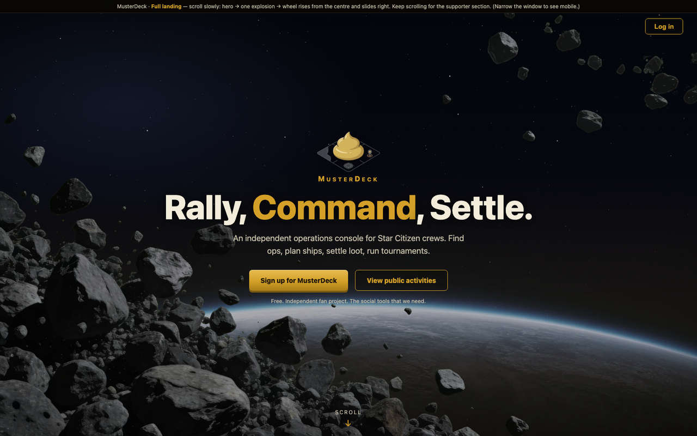
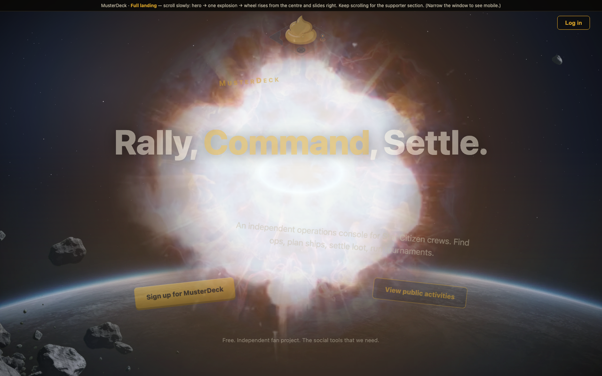
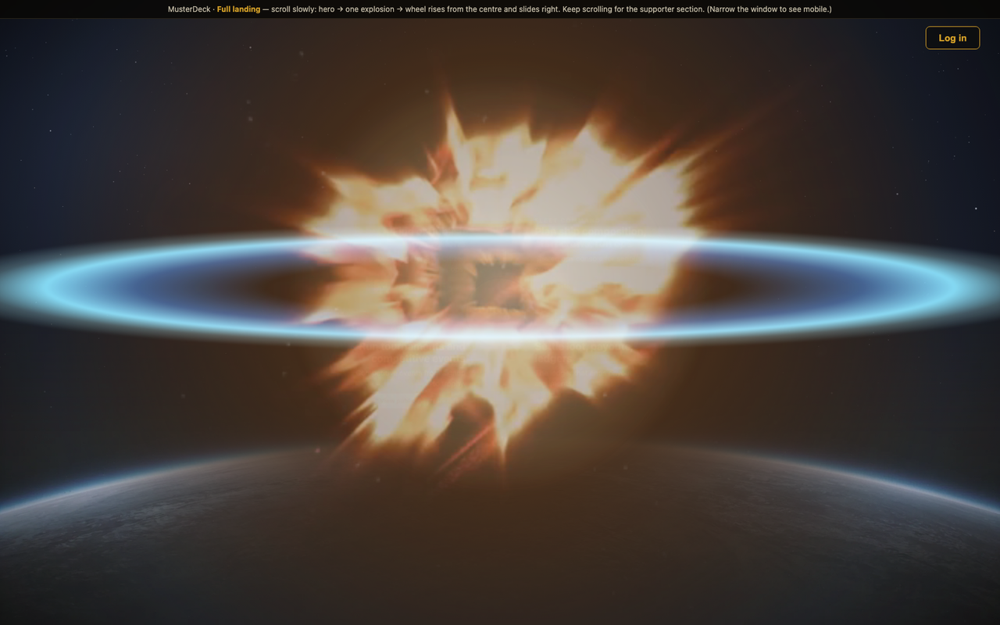
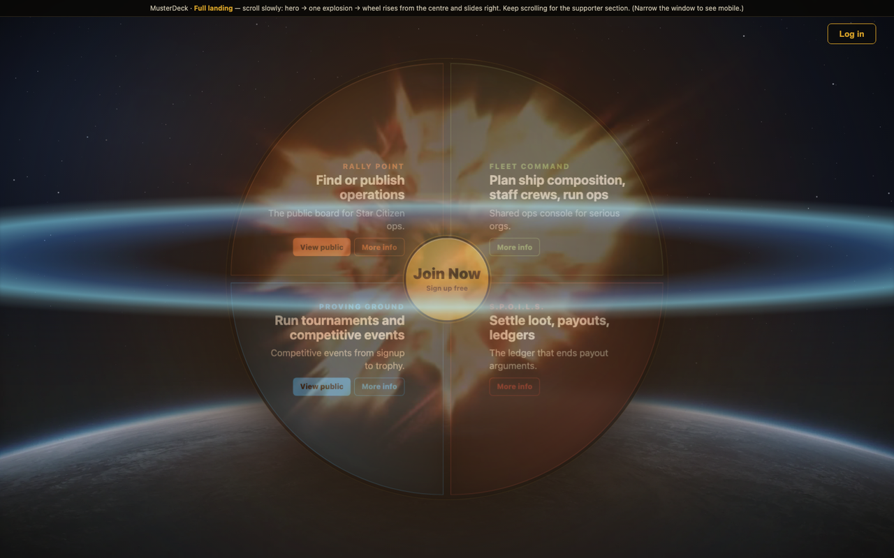
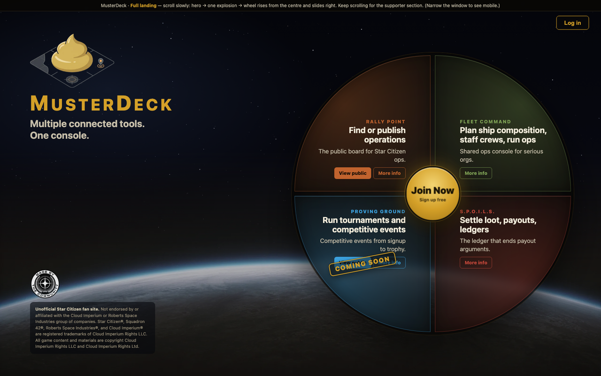
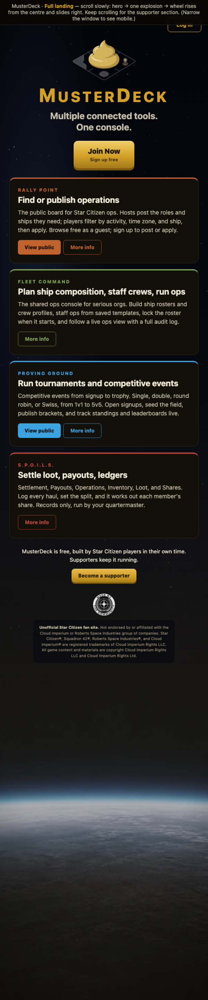

# MusterDeck landing page (mockup)

Status: **locked** 2026-06-16. Self-contained HTML/CSS/JS mockup of the marketing
landing page — the scroll cinematic, the radial tool wheel, and the second-half
layout. Open [`landing.html`](landing.html) directly in a browser (assets are
relative, no server needed).

> The live editable working copy lives at
> `.superpowers/brainstorm/49094-1781514916/content/landing-full.html` (gitignored,
> served via `python3 -m http.server` style on `:8090`). This `docs/landing/` copy
> is the committed, portable snapshot with relative asset paths.

## What it does (top to bottom)

1. **Persistent space + planet background.** A JS starfield, a planet limb along
   the bottom, and a vignette, fixed behind everything — it never scrolls away.
   (Extracted as a reusable component: [`../components/space-planet-background.html`](../components/space-planet-background.html), slated for the Operations Hub.)
2. **Hero** (desktop, pinned): logo + `MUSTERDECK` + "Rally, Command, Settle." +
   subhead + two CTAs, over a field of individually-cut asteroid sprites.
3. **Scroll explosion** (one shot, scrubbed by scroll — never loops): a layered
   blast, then the asteroid field shatters outward and the hero blows apart.
4. **Tool wheel rises from the centre of the blast**, then slides to the right;
   the left column slides in from the left.
5. **Settled second half**: left column splits — brand (logo + name + tagline) to
   the top, the community badge + unofficial-fan-site disclaimer to the bottom (in a
   dark readable box). The 4-quadrant tool wheel sits on the right with a centre
   "Join Now" hub. (No supporter CTA here — becoming a supporter requires being
   logged in, and logged-in users don't see the public landing; that UI lives in
   the reusable [`become-a-supporter`](../components/become-a-supporter.html)
   component for the in-app/account area.)
6. **Mobile (<981px)**: no cinematic — everything stacks (logo, name, tagline,
   four tool island cards, badge, disclaimer) and scrolls normally over the same
   persistent planet.

## Screenshots

| | |
|---|---|
| Hero |  |
| Ignition |  |
| Explosion (blast + blue equatorial pulse) |  |
| Wheel rising from centre |  |
| Settled (split left column + wheel) |  |
| Mobile |  |

### "Coming soon" markers (2026-06-16)

**Proving Ground** carries a diagonal **COMING SOON** stamp on the landing (desktop
wheel quad + mobile card) via `.coming-stamp`. The supporter tier markers (`.soon`
pills on Admiral, the `.soon-tier` Praetorian treatment) live in the
[`become-a-supporter`](../components/become-a-supporter.html) component, since the
supporter UI is not on the public landing. Update these as features ship.

## The explosion (how it's built)

One-shot, **scroll-scrubbed** (driven by scroll position `p`, not autoplay/loop).
It layers, all `mix-blend-mode: screen`:

- **3 stock clips** (`assets/ex_sw4.mp4` orange radial flame rays · `assets/ex_swc.mp4`
  blue shockwave · `assets/ex_sph.mp4` quick spherical white→gold burst). Each is a
  **square** element with `object-fit:cover` and a `radial-gradient(circle closest-side)`
  mask that fades **before** the element edge — so the soft circle is a true circle
  and never shows the 16:9 frame or a hard crop. Scrubbed via `video.currentTime`;
  primed with a muted `play()`→`pause()` so seeking paints frames; transcoded
  all-keyframe (`-g 1`) for smooth seeking.
- **Procedural CSS**: `.ex-core` (soft white/yellow/red radial), `.ex-pulse` (flat
  electric-blue ellipse scaling on X = the pulse riding the horizontal equator),
  `.ex-flash` (brief full-page white flash), and `.ex-glow` (large warm glow that
  lifts the surrounding space so the blast doesn't sit on stark black).

History note: a green-screen fireball (too red), an animated WebP (looped =
"multiple waves"), and an image sequence were all tried and rejected before this
layered approach.

## Tunable parameters (in `landing.html`, the `frame()` loop)

- Blast size: `.ex-vid { width: 135vmin }` + JS `vs = lerp(.6, 1.4, vp)`
- Mask softness / crop: `.ex-vid` mask stops `#000 36% … transparent 80%`
- White flash: `exFlash.style.opacity = … * 0.85`
- Glow: `exGlow.style.opacity = … * 0.85`
- Blue pulse spread: `exPulse … scale(lerp(.2, 4.4, eP), …)`
- Wheel rise→slide windows: `formP = back(rng(p,.48,.66))`, `slideP = ease(rng(p,.64,.84))`
- Second-half split travel: `gd = innerHeight * 0.16` (eased over `rng(p,.66,.92)`);
  settled top/bottom positions come from CSS `space-between`, so they never overflow.
- Scrub length: `body.intro .scrub { height: 320vh }`

## Assets used

`assets/` (all relative): `bg-planet.webp`, `musterdeck-logo.webp`,
`made-by-community.webp`, `ex_sw4.mp4`, `ex_swc.mp4`, `ex_sph.mp4`, and
`sprites/` (32 cut-out asteroid `rN.webp` + `manifest.js`). Source/stock origins
are documented in [`SOURCES.md`](SOURCES.md).

## Reusable components extracted from this page

- [`../components/space-planet-background.html`](../components/space-planet-background.html) — the persistent backdrop (for the hub)
- [`../components/community-badge.html`](../components/community-badge.html) — community badge + fan-site disclaimer (used on the landing footer)
- [`../components/become-a-supporter.html`](../components/become-a-supporter.html) — supporter blurb + button + Patreon tier modal. **Not on the public landing** (becoming a supporter requires login); for the logged-in / account area.
