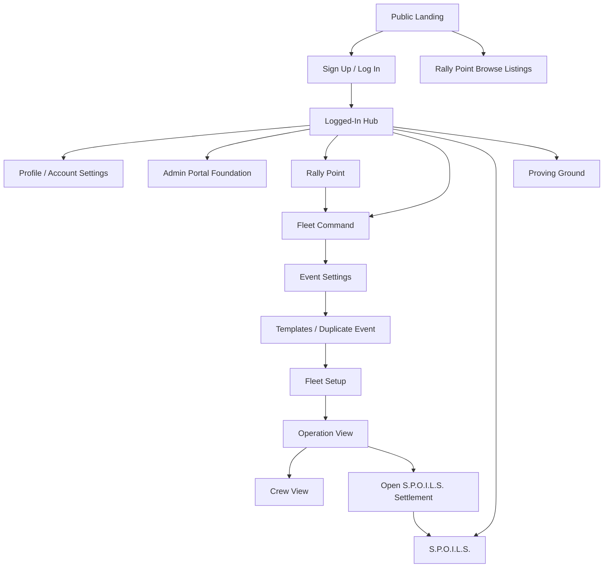

# MusterDeck Shared Foundation Site Plan And Copy Inventory

Date: 2026-05-20

## Purpose

This document defines the first shared foundation workstream for MusterDeck. It covers the site/app structure, first-build screens, major user flows, and copy inventory needed before implementation begins.

MusterDeck is a Star Citizen operations platform with four connected product pillars:

- Rally Point: event discovery and LFG.
- Fleet Command: operation planning, staffing, and live command.
- S.P.O.I.L.S.: settlement, payouts, inventory, loot, and shares.
- Proving Ground: tournament signup, brackets, waves, standings, and score reporting.

The selected planning approach is a hybrid map: define the full platform, but mark each area as Build Now, Draft Now, or Later. The first build focuses on the shared foundation and Fleet Command because those unlock persistent users, permissions, operations, and later Rally Point/S.P.O.I.L.S. flows.

## Build Priority Legend

- Build Now: first implementation workstream.
- Draft Now: screen and copy direction should be prepared now, but production build can follow after foundation.
- Later: known product surface, not needed for the first build.

## Platform Map

## Build Now Screens

### Public Landing

Purpose: explain MusterDeck quickly, create trust, and route users to login, signup, or public Rally Point listings.

Primary content:

- Brand name and short product promise.
- Four pillar summary.
- Calls to action for Sign up, Log in, and Browse Rally Point.
- Fan-project disclaimer in footer.
- Version/status strip for module and Star Citizen data versions.

Key UI areas:

- Header with MusterDeck wordmark, module links, login/signup actions.
- First viewport with the product signal: "Rally, command, settle."
- Pillar overview band.
- Operational flow band: Rally Point to Fleet Command to S.P.O.I.L.S.
- Footer/legal.

### Sign Up / Log In

Purpose: create and recover accounts while preserving one profile across linked identities.

Primary content:

- Email/password signup and login.
- Discord SSO.
- Google SSO.
- Password reset.
- Auth callback/loading state.
- Terms and privacy consent.
- Email verification prompt.

### Logged-In Hub

Purpose: route authenticated users into the four pillars and summarize urgent activity.

Primary content:

- Rally Point entry.
- Fleet Command entry.
- S.P.O.I.L.S. entry.
- Proving Ground entry.
- Recent activity.
- Pending approvals/invites.
- Joined/hosted operations.
- Open settlements.

### Profile / Account Settings

Purpose: maintain identity, trust markers, account preferences, and notification settings.

Primary content:

- Display name/callsign.
- Avatar.
- Bio.
- Primary organization.
- RSI handle and verification status.
- Discord linked state.
- Google linked state.
- Password management for email/password accounts.
- Notification preferences.
- Account deletion request or self-service deletion.

### Admin Portal Foundation

Purpose: give site owners early visibility and control over accounts before public/community use expands.

First-build scope:

- View registered users.
- Search/filter users.
- See account state: email, Discord linked, Google linked, RSI submitted, RSI verified, restricted, banned.
- View created date and last activity.
- Add moderation notes.
- Ban/unban users.
- Restrict/unrestrict users.
- Require manual approval for a user.

Later admin depth:

- Full audit log.
- User event participation history.
- S.P.O.I.L.S. payout/reward history.
- Organization-level admin controls.
- Bulk actions.

### Messages And Notification Center

Purpose: collect general MusterDeck messages, player-to-player messages, personal group messages, assignments, invites, approvals, roster updates, settlement updates, and tournament updates in one place.

Primary content:

- Unread/read states.
- General system messages.
- Player-to-player direct messages.
- Personal group messages.
- Assignment changes.
- Role promotions.
- Rally Point application status.
- Fleet Command roster/status changes, but not Fleet Command chat threads.
- S.P.O.I.L.S. settlement and payout updates.
- Proving Ground registration, match, score, and advancement updates.
- Notification preferences link.

Boundary:

- Fleet Command fleet-wide, team, ship, and command messages stay inside Fleet Command.
- The shared window may show a Fleet Command assignment or roster alert later, but the conversation itself should remain inside the active Fleet Command event.

### Footer / Legal Shell

Purpose: make fan-project status, privacy, terms, and support visible on every page.

Primary content:

- Fan-project disclaimer.
- Privacy Policy link.
- Terms of Service link.
- Discord/community support link when available.
- Network/status link when available.
- Optional Made by the Community badge if allowed by fan-kit rules.

## Fleet Command Build Now Screens

### Event Settings

Purpose: define the operation before fleet setup begins.

Primary content:

- Event title.
- Operation type/template.
- Objective/briefing.
- Start time and duration.
- Visibility: public, unlisted, private, org-only.
- Join link and join code.
- Access requirements: Discord linked, RSI verified, manual approval.
- Officer roles.
- Voice/comms instructions.
- Event status.
- Core phase field.

### Templates / Duplicate Event

Purpose: help officers quickly repeat weekly or recurring operations.

Primary content:

- Save current event as template.
- Duplicate an existing event.
- Template name and description.
- Included fields: event settings, fleet lines, teams, staffing profiles, custom positions.
- Excluded fields: live assignments, check-ins, messages, S.P.O.I.L.S. settlement state.

### Fleet Setup

Purpose: let Fleet Admiral/officers design the requested fleet.

Primary content:

- Add specific ship.
- Add ship type/category request.
- Quantity.
- Team assignment.
- Staffing profile: Skeleton, Standard, Full Crew, Custom.
- Crew target.
- Custom position editor.
- Current fleet setup table.
- Change requests and session history.

### Operation View

Purpose: officer-facing command surface for running the event.

Primary content:

- Fleet roster by ship/team/category.
- Ship roster locks.
- Move crew between ships/teams.
- Approve/deny change requests.
- Send operational updates.
- View message/session history.

### Crew View

Purpose: member-facing participation view.

Primary content:

- Browse open positions.
- Bring ship.
- Claim/fill role.
- Check in.
- Acknowledge assignment changes.
- Request assignment change.
- Read orders/updates.

## Draft Now Screens

### Rally Point

Screens to draft:

- Browse Listings.
- Listing Detail.
- Create Listing.
- Applicant Queue.

Rally Point should be drafted now because its copy and data model affect shared account fields, access rules, notifications, and Fleet Command event creation.

### S.P.O.I.L.S.

Screens to draft:

- Settlement List.
- Inventory Groups.
- Approval Queue.
- Payout Calculator.

S.P.O.I.L.S. should be drafted now because its terms, roles, notification events, and profile history fields affect the shared foundation.

### Proving Ground

Screens to draft:

- Tournament Overview.
- Tournament Signup.
- Tournament Admin Setup.
- Bracket / Waves.
- Score Desk.
- Standings.

Proving Ground should be drafted now because tournament registration, team identities, match notifications, score reporting, and prize/payout handoff affect the shared account, notification, admin, and S.P.O.I.L.S. foundation.

### Cross-App Supporting Screens

Screens to draft:

- Profile Modal.
- Activity Chat.
- Legal pages.
- Data/version status page.

## Later Screens

Later screens remain visible in the platform plan but are not first-build requirements:

- Public Rally Point stats.
- Calendar export/share management.
- Advanced live Fleet Command phase controls.
- S.P.O.I.L.S. item catalog/pricing depth.
- S.P.O.I.L.S. cross-event reward history.
- Organization dashboard.
- Deep data source status tools.

## Screen-Level Copy Inventory

### Global Navigation

Required copy:

- Product name.
- Module names.
- Logged-out nav labels.
- Logged-in nav labels.
- Active state labels.
- Mobile menu labels.
- Version/status strip labels.
- Account menu labels.

Initial labels:

- MusterDeck
- Rally Point
- Fleet Command
- S.P.O.I.L.S.
- Proving Ground
- Log in
- Sign up
- Account
- Admin
- Notifications
- Log out
- Star Citizen data
- Catalog sync

### Public Landing

Required copy:

- H1.
- Short subhead.
- Primary CTA.
- Secondary CTA.
- Browse CTA.
- Four pillar descriptions.
- Cross-pillar workflow explanation.
- Trust/disclaimer block.
- Footer legal links.
- Social preview title/description.

Draft direction:

- H1: Rally, command, settle.
- Subhead: Plan Star Citizen operations, staff the fleet, and settle rewards from one shared deck.
- Primary CTA: Create account.
- Secondary CTA: Log in.
- Browse CTA: Browse Rally Point.

### Authentication

Required copy:

- Login heading.
- Signup heading.
- Email label.
- Password label.
- Confirm password label.
- Discord SSO button.
- Google SSO button.
- Forgot password link.
- Reset password instructions.
- Email verification instructions.
- Auth callback/loading message.
- Terms/privacy consent text.
- Error messages.

Initial labels:

- Log in to MusterDeck
- Create your MusterDeck account
- Continue with Discord
- Continue with Google
- Continue with email
- Send reset link
- Check your email
- I agree to the Terms of Service and Privacy Policy

### Logged-In Hub

Required copy:

- Welcome heading.
- Four pillar card titles and descriptions.
- Recent activity labels.
- Empty states.
- Pending invite labels.
- Pending approval labels.
- Open settlement labels.

Initial labels:

- Operations Hub
- Find an operation
- Command an operation
- Settle rewards
- No pending approvals
- No active settlements
- Recent activity

### Account Settings

Required copy:

- Section headings.
- Field labels.
- Helper text.
- Verification states.
- Linked identity states.
- Notification category descriptions.
- Save/cancel buttons.
- Success/error messages.
- Account deletion warning.

Initial labels:

- Profile
- Callsign
- Primary organization
- RSI handle
- Verification pending
- RSI verified
- Discord linked
- Google linked
- Notification preferences
- Save changes

### Admin Portal Foundation

Required copy:

- Page heading.
- User table column labels.
- Filter labels.
- Account state labels.
- Moderation action labels.
- Confirmation modal copy.
- Empty states.
- Error/success messages.

Initial labels:

- Admin Portal
- Registered users
- Search users
- Account state
- Last active
- Moderation notes
- Restrict user
- Ban user
- Require approval
- Restore access

### Notification Center

Required copy:

- Page/drawer heading.
- Notification type labels.
- Read/unread labels.
- Empty states.
- Preference links.
- Action CTAs.

Initial labels:

- Notifications
- Mark all as read
- Assignment updated
- Role invite
- Application approved
- Ship offer denied
- Settlement finalized
- No notifications

### Event Settings

Required copy:

- Form labels.
- Helper text.
- Visibility descriptions.
- Access requirement descriptions.
- Join code/link labels.
- Officer role labels.
- Status/phase labels.
- Save/publish CTAs.
- Validation errors.

Initial labels:

- Event Settings
- Operation title
- Operation type
- Objective
- Start time
- Duration
- Visibility
- Access requirements
- Require Discord linked
- Require RSI verified
- Manual approval required
- Join code
- Copy join link
- Save event
- Publish listing

### Templates / Duplicate Event

Required copy:

- Page heading.
- Template field labels.
- Include/exclude explanations.
- Duplicate confirmation.
- Empty state.
- Success/error messages.

Initial labels:

- Event Templates
- Save as template
- Duplicate event
- Template name
- Includes fleet setup and event settings
- Does not include live assignments or messages

### Fleet Setup

Required copy:

- Page heading.
- Setup mode labels.
- Ship search placeholder.
- Field labels.
- Staffing profile descriptions.
- Position editor labels.
- Remove confirmation.
- Empty states.

Initial labels:

- Fleet Setup
- Specific Ship
- Ship Type
- Search ships
- Team
- Quantity
- Skeleton
- Standard
- Full Crew
- Custom
- Crew target
- Add Fleet Line
- Select Positions

### Operation View

Required copy:

- Page heading.
- Search placeholder.
- View switch labels.
- Lock/unlock labels.
- Change request labels.
- Move/assign labels.
- Message history labels.
- Empty states.

Initial labels:

- Operation Command View
- Search fleet
- Bring Ship
- Expand Rosters
- Collapse Rosters
- Ship Roster Locked
- Ship Roster Open
- Change Requests
- Session History

### Crew View

Required copy:

- Page heading.
- Position claim labels.
- Bring ship labels.
- Check-in modal copy.
- Assignment prompt copy.
- Change request copy.
- Orders/update labels.
- Empty states.

Initial labels:

- Crew View
- Available
- Unassigned Ships
- Check in
- Request change
- Acknowledge orders
- Orders / Updates

### Footer And Legal

Required copy:

- Fan-project disclaimer.
- Privacy summary.
- Terms summary.
- Data/status description.
- Support/community label.

Required disclaimer:

MusterDeck is an independent fan-made tool for Star Citizen players and organizations. It is not affiliated with, endorsed by, sponsored by, or officially connected to Cloud Imperium Games, Roberts Space Industries, or their affiliates. Star Citizen and related names, marks, and assets belong to their respective owners.

## Brand And Voice Work Needed Next

Before final copy is written, create a brand guide covering:

- Product positioning.
- Audience.
- Brand promise.
- Voice principles.
- Vocabulary rules.
- Module naming rules.
- Error and notification tone.
- Legal/fan-project language boundaries.
- Visual direction.
- Color and typography rules.
- Example copy blocks.

Recommended voice direction:

- Operational, direct, and clear.
- Tactical without parody.
- Confident but not militarized to the point of roleplay noise.
- Helpful for large org leaders and readable for casual crew.
- Avoid official-sounding claims, guaranteed payout language, and copied CrewTerminal/scfleets.space wording.

## Recommended Thread Split

Use this current thread as the master planning thread.

Recommended next threads:

1. Brand guide and brand voice.
2. Shared foundation implementation: auth, profiles, hub, admin foundation.
3. Fleet Command implementation: event settings, templates, setup, operation, crew views.
4. Rally Point design.
5. S.P.O.I.L.S. design.
6. Proving Ground tournament design.
6. Notifications, chat, and access rules.

## Acceptance Checklist

- The first build includes shared foundation, admin portal foundation, Fleet Command event settings, and event templates.
- Rally Point, S.P.O.I.L.S., and Proving Ground are represented but not forced into the first implementation slice.
- Copy inventory identifies all major copy surfaces needed before writing production copy.
- Legal/fan-project copy is visible across public and authenticated screens.
- Brand guide and brand voice are treated as the next required artifact before final copywriting.
